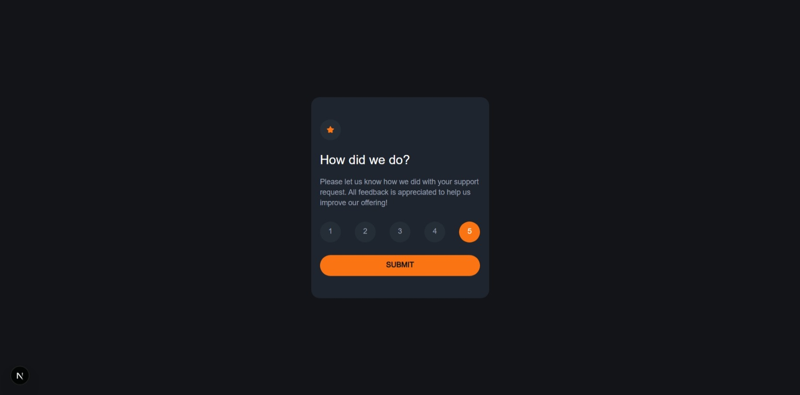
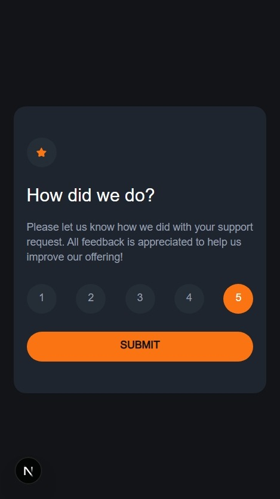
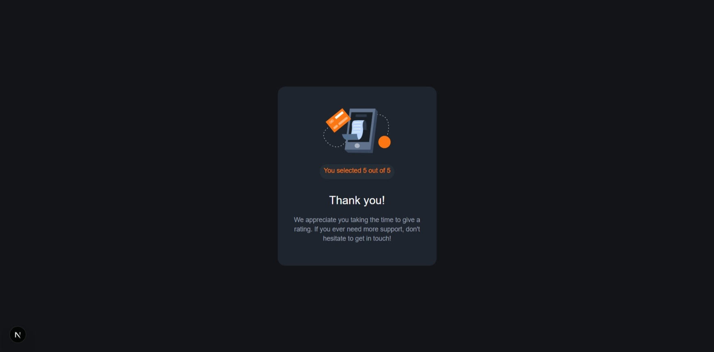
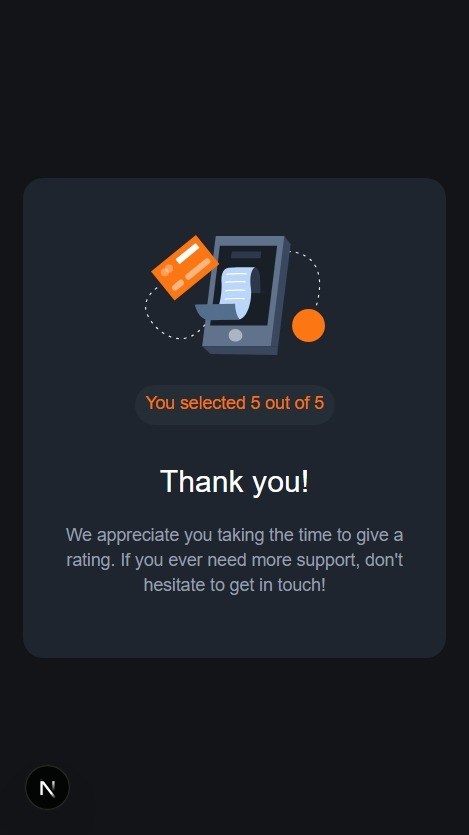

# interactive-rating-component

Users should be able to:

- View the optimal layout for the app depending on their device's screen size
- See hover states for all interactive elements on the page
- Select and submit a number rating
- See the "Thank you" card state after submitting a rating

### Screenshot

### Links

- Solution URL: (https://github.com/konraddissake1808/interactive-rating-component)
- Live Site URL: (https://interactive-rating-component-six-omega.vercel.app/)

### Built with

- Semantic HTML5 markup
- CSS custom properties
- Flexbox
- Mobile-first workflow
- [React](https://reactjs.org/) - JS library
- [Next.js](https://nextjs.org/) - React framework

## Author

- Frontend Mentor - [@konraddissake1808](https://www.frontendmentor.io/profile/konraddissake1808)
- LinkedIn - [Konrad Dissake Ngando](www.linkedin.com/in/konrad-dissake-ngando)